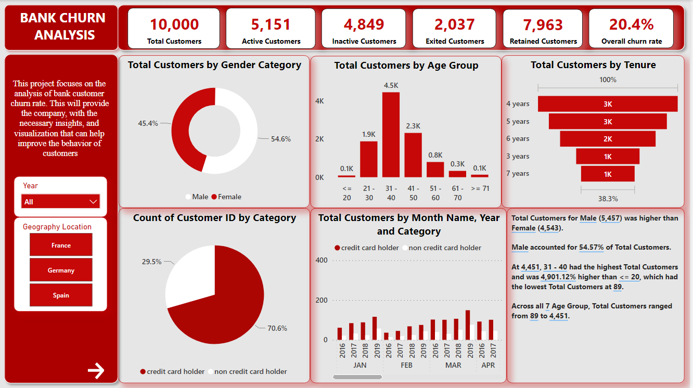
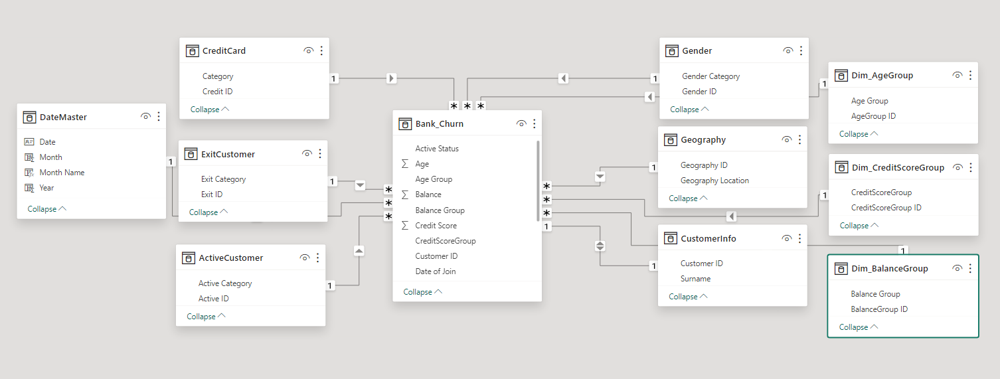

# Bank-Churn_Analysis

---

### Project Overview:
This project aims to analyze data related to bank churn in order to uncover the underlying patterns and factors that affect customer attrition.

### Data Sources:
The dataset utilized for this analysis focuses on customer related information. This is stored in both CSV and excel file formats. It contains details about customer demographics, interactions and transactional histories enabling us to delve into customer behavior.

### Tools
I utilized Excel and Power Query Editor for analysis well as PowerBi for visualizing the banking datasets. My objective extended beyond identifying churners; I aimed to comprehend the reasons and methods, behind it.

### Data Cleaning and Preparation:
I addressed missing values and inconsistencies.

### Modelling:
I automatically established connections. Made adjustments to remove any relationships replacing them with the necessary ones.

---

* The model is a star schema.
* There are 10-dimension tables with 1 fact table. The dimension tables are all joined to the fact table with a one-to-many relationship.

### Exploratory Data Analysis (EDA)
I uncovered factors that affect churn rates and analyzed the patterns and trends in customer transactions within the dataset, which ultimately leads to customer attrition.
Through this project I discovered customer segments that are more likely to churn and identified the factors that influence their decision to leave. For instance it was found that males had the highest percentage of customers who exited at 55.9% while the age group, between 41 and 50 years had the highest number of customers who exited. Additionally it was revealed that most customers tend to leave within a span of four years.

### Recommendations:
To ensure customer retention it is advisable to consider strategies, like enhancing customer service providing by implementing proactive measures to retain customers.

#### _You can interact with the dashboard_ [here](https://app.powerbi.com/links/t0mN9DaXwX?ctid=7a7d9927-84e9-4910-b10f-850c64b28029&pbi_source=linkShare)
